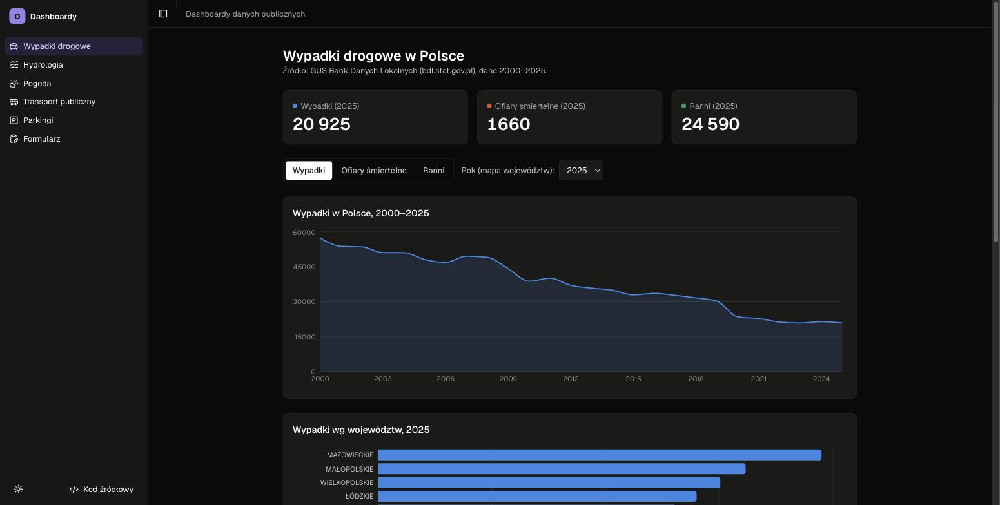
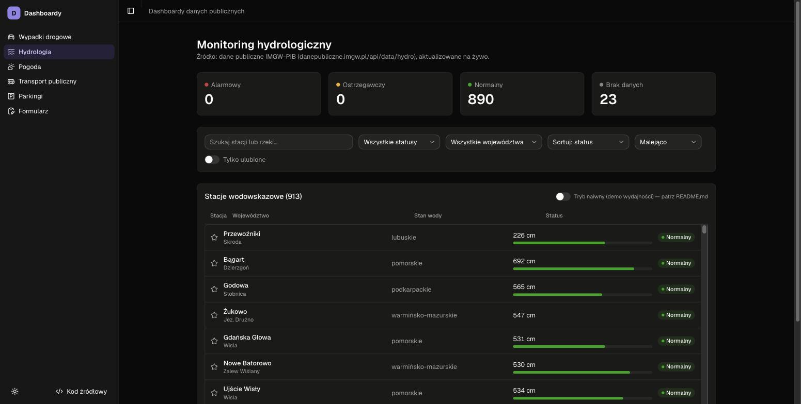
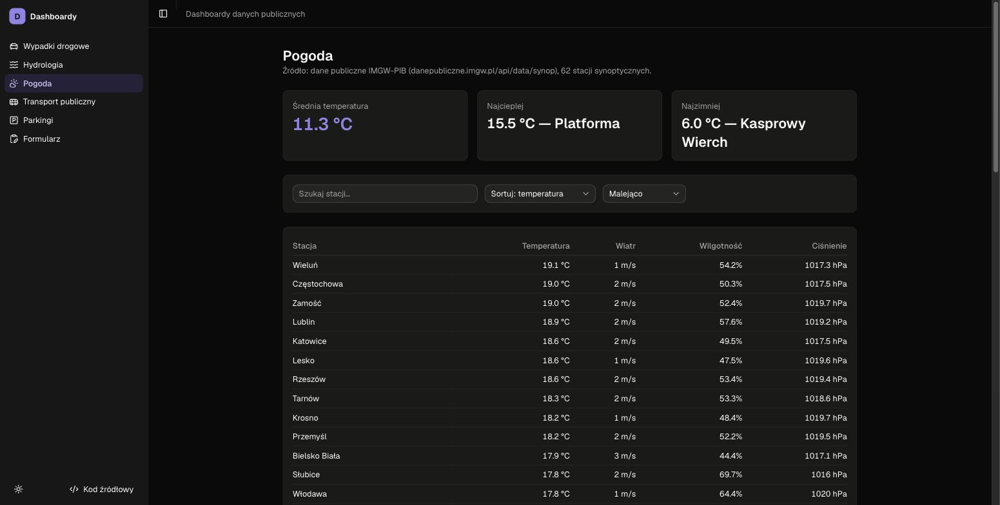
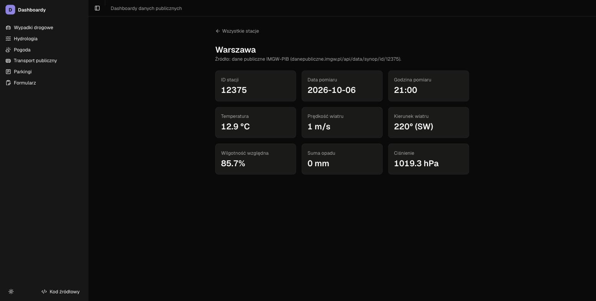
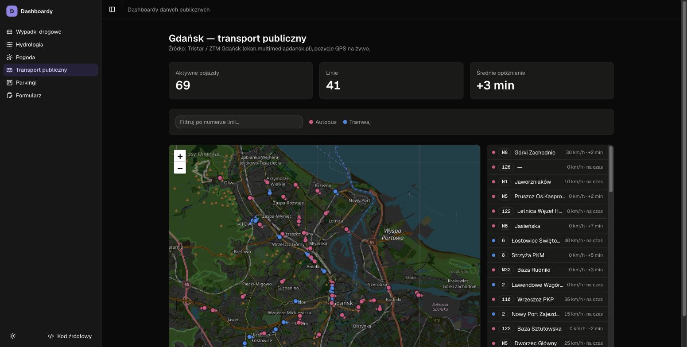
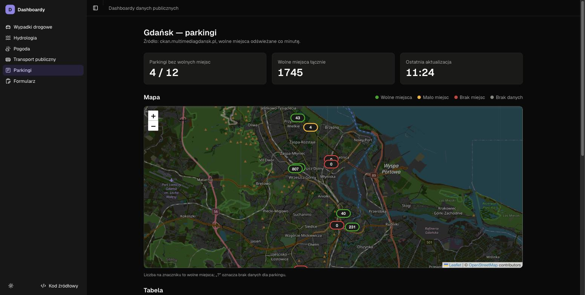
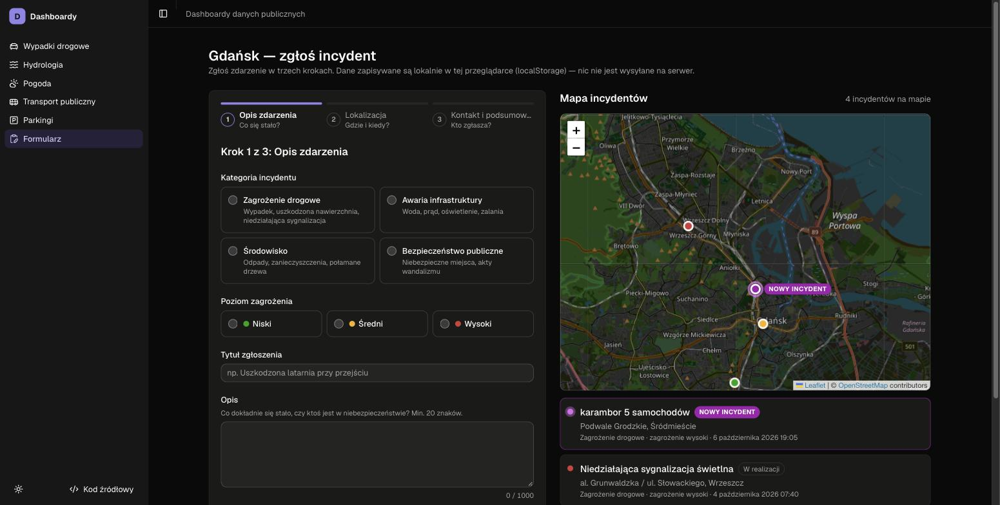

# Dashboardy danych publicznych

Sześć dashboardów na otwartych danych publicznych z Polski i Gdańska: wypadki
drogowe (GUS), stany rzek i pogoda (IMGW), komunikacja miejska na żywo i wolne
miejsca na parkingach (Gdańsk), oraz formularz zgłaszania incydentów z mapą.

> ## 🔗 Demo na żywo: **[tasks-taupe-xi.vercel.app](https://tasks-taupe-xi.vercel.app)**
>
> Bez logowania i bez kluczy API — wszystkie dane pobierane są na żywo z publicznych źródeł.

[](https://tasks-taupe-xi.vercel.app/road-accidents)

## Spis treści

- [Stack i wersje](#stack-i-wersje)
- [Instalacja i uruchomienie](#instalacja-i-uruchomienie)
- [Biblioteki](#biblioteki)
- [Źródła danych (API)](#źródła-danych-api)
- [Zakładki](#zakładki)
  1. [Wypadki drogowe](#1-wypadki-drogowe) — `/road-accidents`
  2. [Hydrologia](#2-hydrologia) — `/hydrologia`
  3. [Pogoda](#3-pogoda) — `/pogoda`, `/pogoda/[id]`
  4. [Transport publiczny](#4-transport-publiczny) — `/transport`
  5. [Parkingi](#5-parkingi) — `/parkingi`
  6. [Formularz zgłoszenia](#6-formularz-zgłoszenia) — `/formularz`
- [Architektura i style programowania](#architektura-i-style-programowania)
- [Dostępność (WCAG 2.1 AA)](#dostępność-wcag-21-aa)
- [Struktura katalogów](#struktura-katalogów)

## Stack i wersje

| | Wersja |
|---|---|
| **Node.js** | `>= 20.9` (wymaganie Next.js; projekt rozwijany na **24.15**) |
| **npm** | 11.x |
| **Next.js** | **16.3.6** — App Router, Server Components, route handlers, Turbopack |
| **React** | **19.2.8** (+ React Compiler lint) |
| **TypeScript** | 5.9.3 |
| **Tailwind CSS** | 4.3.3 |
| **Hosting** | Vercel, funkcje w regionie `fra1` (Frankfurt) — najbliżej polskich API ([`vercel.json`](vercel.json)) |

## Instalacja i uruchomienie

```bash
git clone https://github.com/imicadio/tasks.git
cd tasks
npm install
npm run dev          # http://localhost:3000
```

Nie są potrzebne żadne zmienne środowiskowe ani klucze API.

| Skrypt | Co robi |
|---|---|
| `npm run dev` | serwer deweloperski (Turbopack) na `localhost:3000` |
| `npm run build` | build produkcyjny |
| `npm run start` | uruchamia build produkcyjny |
| `npm run lint` | ESLint — w tym reguły architektury (patrz [Architektura i style programowania](#architektura-i-style-programowania)) |
| `npm test` | testy Vitest (jednorazowo) |
| `npm run test:watch` | testy w trybie watch |

## Biblioteki

| Biblioteka | Wersja | Do czego |
|---|---|---|
| `@tanstack/react-query` | 5.104.0 | stan serwerowy po stronie klienta: cache, odświeżanie, polling |
| `@tanstack/react-virtual` | 3.14.13 | wirtualizacja listy ~900 stacji hydrologicznych |
| `zustand` | 5.0.15 | stan globalny klienta (ulubione stacje, szkic formularza) z `persist` |
| `zod` | 4.6.5 | walidacja odpowiedzi API, parametrów zapytań i formularza |
| `recharts` | 3.10.1 | wykresy (trend, słupki wg województw) |
| `leaflet` / `react-leaflet` | 1.9.4 / 5.0.0 | mapy (transport, parkingi, incydenty) na kafelkach OpenStreetMap |
| `@base-ui/react` | 1.8.0 | prymitywy UI (Select, Switch…) pod komponentami shadcn |
| `shadcn` | 4.21.0 | generator komponentów UI do `src/shared/ui` |
| `next-themes` | 0.4.6 | tryb jasny/ciemny |
| `lucide-react` | 1.49.0 | ikony |
| `cn`, `class-variance-authority`, `tw-animate-css` | 0.4.0, 0.7.1, 1.4.0 | klasy Tailwind, warianty, animacje |

Narzędzia deweloperskie: **Vitest** 5.0.3, **Testing Library** 16.3.3, **jest-axe** 11.0.0 (testy dostępności), **ESLint** 9.39.5 z `eslint-config-next` 16.3.6, **jsdom**.

## Źródła danych (API)

Wszystkie API są publiczne i działają bez klucza. Aplikacja nigdy nie woła ich z przeglądarki — pobiera je serwer (z cache), a klient rozmawia tylko z własnymi endpointami `/api/*`.

| API | Adres | Używa | Cache po stronie serwera |
|---|---|---|---|
| **GUS — Bank Danych Lokalnych** | `bdl.stat.gov.pl/api/v1` | Wypadki drogowe | 1 h |
| **IMGW-PIB — dane hydrologiczne** | `danepubliczne.imgw.pl/api/data/hydro` | Hydrologia | 5 min |
| **IMGW-PIB — dane synoptyczne** | `danepubliczne.imgw.pl/api/data/synop` | Pogoda | 5 min |
| **Tristar / ZTM Gdańsk — pozycje GPS** | `ckan2.multimediagdansk.pl/gpsPositions` | Transport | 10 s |
| **ZTM Gdańsk — lista linii** | `ckan.multimediagdansk.pl/…/routes.json` | Transport (autobus / tramwaj) | 1 h |
| **Gdańsk — parkingi i wolne miejsca** | `ckan.multimediagdansk.pl/…/parking-lots.json`, `ckan3.multimediagdansk.pl/parkingLots` | Parkingi | 1 h / 30 s |
| **OpenStreetMap Nominatim** | `nominatim.openstreetmap.org/reverse` | Formularz (adres z mapy) | 24 h na punkt |
| **OpenStreetMap — kafelki mapy** | `tile.openstreetmap.org` | wszystkie mapy | — |

Każda odpowiedź przechodzi przez schemat **zod** i jest mapowana na typy domenowe — m.in. dlatego, że IMGW w tej samej tablicy zwraca liczby raz jako `number`, a raz jako `string` ([ADR 0003](docs/decisions/0003-api-data-validation.md)).

## Zakładki

| # | Zakładka | Na żywo | Dane |
|---|---|---|---|
| 1 | [Wypadki drogowe](#1-wypadki-drogowe) | [/road-accidents](https://tasks-taupe-xi.vercel.app/road-accidents) | GUS BDL, 2000–2025 |
| 2 | [Hydrologia](#2-hydrologia) | [/hydrologia](https://tasks-taupe-xi.vercel.app/hydrologia) | IMGW, ~900 stacji |
| 3 | [Pogoda](#3-pogoda) | [/pogoda](https://tasks-taupe-xi.vercel.app/pogoda) | IMGW, 62 stacje synoptyczne |
| 4 | [Transport publiczny](#4-transport-publiczny) | [/transport](https://tasks-taupe-xi.vercel.app/transport) | Tristar GPS, Gdańsk |
| 5 | [Parkingi](#5-parkingi) | [/parkingi](https://tasks-taupe-xi.vercel.app/parkingi) | ckan Gdańsk |
| 6 | [Formularz zgłoszenia](#6-formularz-zgłoszenia) | [/formularz](https://tasks-taupe-xi.vercel.app/formularz) | localStorage + Nominatim |

### 1. Wypadki drogowe

[](https://tasks-taupe-xi.vercel.app/road-accidents)

Statystyki wypadków drogowych w Polsce z GUS: liczba wypadków, ofiar śmiertelnych i rannych.

- **Funkcje:** kafelki z wartościami za ostatni rok, przełącznik metryki, wykres trendu 2000–2025, wykres słupkowy wg województw z wyborem roku i tabelą z tymi samymi liczbami.
- **API:** GUS BDL (zmienne 7849 / 7850 / 7851, poziom kraju i województw) → `GET /api/road-accidents?kind=trend|breakdown&metric=…`.
- **Jak działa:** strona jest statyczna z ISR (odświeżanie co 1 h) — dane startowe składa `getRoadAccidentsPageData()` na serwerze, wszystkie zapytania do GUS idą równolegle. Zmiana metryki/roku dociąga dane z własnego endpointu.

### 2. Hydrologia

[](https://tasks-taupe-xi.vercel.app/hydrologia)

Monitoring ~900 stacji wodowskazowych IMGW: aktualny stan wody względem progów ostrzegawczego i alarmowego.

- **Funkcje:** kafelki z liczbą stacji w każdym statusie (klik filtruje listę), wyszukiwarka, filtr statusu i województwa, sortowanie, ulubione stacje (zapamiętywane w przeglądarce), pasek wypełnienia względem progu.
- **API:** IMGW hydro → `GET /api/hydro-monitor?q=&status=&voivodeship=&sort=&dir=`.
- **Jak działa:**
  - status stacji (`alarm` / `warning` / `normal` / `unknown`) wyliczany jest z surowych pomiarów w jednym miejscu (warstwa anti-corruption, [ADR 0003](docs/decisions/0003-api-data-validation.md));
  - filtry żyją w URL, więc widok da się wysłać linkiem; dane w React Query, ulubione w Zustand ([ADR 0002](docs/decisions/0002-state-architecture.md));
  - lista jest **wirtualizowana i memoizowana** — przełącznik „Tryb naiwny” pokazuje na żywo różnicę w liczbie renderów ([ADR 0004](docs/decisions/0004-list-rendering-performance.md));
  - dla czytników ekranu obok listy renderowana jest ukryta, semantyczna tabela ([ADR 0005](docs/decisions/0005-accessibility.md)).

### 3. Pogoda

[](https://tasks-taupe-xi.vercel.app/pogoda)

Bieżące warunki na 62 stacjach synoptycznych IMGW.

- **Funkcje:** średnia temperatura oraz najcieplejsze i najzimniejsze miejsce, wyszukiwarka, sortowanie po temperaturze / wietrze / nazwie, tabela z temperaturą, wiatrem, wilgotnością i ciśnieniem. Klik w stację otwiera stronę szczegółów z wszystkimi 10 polami pomiaru (m.in. kierunek wiatru jako róża 16-kierunkowa).
- **API:** IMGW synop (lista i `/synop/id/{id}`) → `GET /api/weather`, `GET /api/weather/[id]`.
- **Jak działa:** pierwszy render na serwerze (`getWeatherPageData()`), dalsze zmiany wyszukiwania i sortowania przez React Query; nieznana stacja zwraca 404.

[](https://tasks-taupe-xi.vercel.app/pogoda/12375)

### 4. Transport publiczny

[](https://tasks-taupe-xi.vercel.app/transport)

Mapa pojazdów komunikacji miejskiej w Gdańsku na żywo (pozycje GPS z systemu Tristar).

- **Funkcje:** liczba aktywnych pojazdów i linii, średnie opóźnienie, filtr po numerze linii, mapa z kolorem wg typu (autobus / tramwaj) i strzałką kierunku, lista pojazdów z opóźnieniem — klik przybliża mapę do pojazdu.
- **API:** Tristar GPS + lista linii ZTM (typ pojazdu z `routeType`, nie zgadywany z numeru) → `GET /api/transit?route=`.
- **Jak działa:**
  - klient odpytuje serwer co 15 s, serwer trzyma feed GPS w cache 10 s, więc wielu oglądających nie obciąża źródła;
  - markery są animowane płynnie między kolejnymi odczytami (interpolacja w `requestAnimationFrame`) i zarządzane imperatywnie w Leaflet, bez re-renderów Reacta co klatkę ([ADR 0006](docs/decisions/0006-realtime-map-rendering.md)).

### 5. Parkingi

[](https://tasks-taupe-xi.vercel.app/parkingi)

Parkingi w Gdańsku z liczbą wolnych miejsc na żywo.

- **Funkcje:** liczba pełnych parkingów, suma wolnych miejsc, czas ostatniej aktualizacji, mapa ze znacznikami pokazującymi liczbę wolnych miejsc (kolor wg statusu), w pełni dostępna tabela z przyciskiem „pokaż na mapie”.
- **API:** dwa feedy ckan Gdańska — lista parkingów i stan wolnych miejsc — łączone po `id` → `GET /api/parking`.
- **Jak działa:** strona statyczna z ISR co 30 s, klient odświeża co 60 s. Status nie zależy od samego koloru — na znaczniku zawsze jest liczba, a w tabeli tekst (WCAG 1.4.1).

### 6. Formularz zgłoszenia

[](https://tasks-taupe-xi.vercel.app/formularz)

Trzykrokowy formularz zgłoszenia incydentu w Gdańsku z mapą zgłoszeń.

- **Funkcje:** krok 1 — kategoria, poziom zagrożenia, tytuł, opis; krok 2 — miejsce (klik na mapie, wpisanie współrzędnych albo wybór dzielnicy) i adres uzupełniany automatycznie, data; krok 3 — kontakt, podsumowanie, zgoda. Po wysłaniu zgłoszenie pojawia się na mapie i liście jako „NOWY INCYDENT”.
- **API:** OSM Nominatim (reverse geocoding) → `GET /api/incident-report/geocode?lat=&lon=`.
- **Jak działa:**
  - brak backendu — szkic i zgłoszenia zapisywane są w `localStorage` (Zustand `persist`), więc odświeżenie strony nie gubi danych;
  - walidacja per krok schematami zod, z fokusem na pierwszym błędnym polu i komunikatami powiązanymi przez `aria-describedby`;
  - geokodowanie idzie przez własny endpoint z cache 24 h, zgodnie z zasadami użycia Nominatim (User-Agent, ≤ 1 req/s).

## Architektura i style programowania

### Architektura plików: feature-based (vertical slices)

Kod jest podzielony **według funkcji produktu, a nie według typu pliku**. Każdy dashboard to samodzielny moduł (pionowy „plaster” od API po UI), a całość to modularny monolit w trzech warstwach z zależnościami tylko w jedną stronę:

```
app  ──▶  features  ──▶  shared
```

| Warstwa | Zawartość | Zasada |
|---|---|---|
| `src/app/` | routing: `page.tsx`, `layout.tsx`, `loading.tsx`, `error.tsx`, `api/*/route.ts` | cienka — parsuje parametry i wywołuje **jedną** funkcję z feature'a |
| `src/features/<nazwa>/` | wszystko o jednym pojęciu produktu: UI, hooki, zapytania serwerowe, walidacja, typy | moduł zamknięty; inne warstwy importują go **tylko przez `index.ts`** |
| `src/shared/` | kod bez pojęć domenowych: prymitywy UI, generyczne hooki i utils | nie zależy od `features/` ani `app/` |

Wewnątrz feature'a każdy plik ma jeden rodzaj zawartości:

```
features/hydro-monitor/
  index.ts          # publiczne API modułu (jedyne, co widzą inne warstwy)
  schemas.ts        # zod: walidacja odpowiedzi API i parametrów
  constants/        # wartości (as const), etykiety, URL-e
  types/            # typy domenowe (wyprowadzane ze stałych)
  utils/            # czyste funkcje + testy
  hooks/            # stan i efekty (URL, React Query, store)
  components/       # komponenty; pomocnicze w _internal/
  server/           # queries.ts (server-only), page-data.ts
```

Dzięki temu feature można przenieść, usunąć albo przepisać w całości, a zależności między modułami widać w jednym pliku (`index.ts`). Granice pilnuje ESLint (`no-restricted-imports`). Pełna specyfikacja: [`docs/ARCHITECTURE.md`](docs/ARCHITECTURE.md).

### Zasady i style programowania

| Zasada | Jak jest stosowana w projekcie |
|---|---|
| **SOLID — S** (single responsibility) | komponent renderuje jedno, hook zarządza jednym kawałkiem stanu, util robi jedną transformację; dashboard to tylko spis sekcji (`<StatusKpiTiles>`, `<FiltersBar>`, `<StationList>`) |
| **SOLID — O, D** (open/closed, dependency inversion) | kompozycja zamiast flag: `<StationRows>` wybiera `<VirtualStationRows>` lub `<NaiveStationRows>`; komponenty dostają dane i callbacki przez propsy, logikę wstrzykują hooki |
| **DRY** | przy drugim wystąpieniu kod trafia do wspólnego miejsca — np. `useDebouncedUrlParam`, `OptionSelect`, `StatTile`, `FetchStatus`, `paginate`, `escapeHtml` w `src/shared/` |
| **YAGNI** | brak spekulatywnych propsów, opcji i warstw „na zapas”; martwy kod i zdublowane efekty są usuwane |
| **KISS** | jawny kod zamiast sprytnej konfiguracji; małe pliki (maks. 100 linii kodu na komponent) |
| **Early return** | wybór między dwoma drzewami JSX to osobny komponent z `if … return`, nie ternary w JSX |
| **Programowanie funkcyjne** | logika w czystych funkcjach w `utils/` (bez efektów ubocznych, łatwe do testowania), dane niemutowalne |
| **Deklaratywny UI + logika w hookach** | komponenty to JSX i propsy; stan, URL, fetchowanie i efekty żyją w `hooks/` (podział container / presentational) |
| **Single source of truth** | każdy zbiór wartości (statusy, typy, sortowanie) to jedna mapa `as const`, z której wyprowadzane są typy (`ValueOf`), schematy zod i etykiety |
| **Anti-corruption layer** (z DDD) | odpowiedzi zewnętrznych API są parsowane i mapowane na typy domenowe na wejściu — dalej nikt nie zna nazw pól IMGW czy GUS |
| **Parse, don't validate** | zod przekształca niepewne dane w pewne typy już w `schemas.ts`; reszta kodu pracuje na typach, nie na `unknown` |
| **Branded types** | identyfikatory (`StationId`, `VehicleId`, `ParkingLotId`) nie dają się pomylić ze zwykłym stringiem/liczbą |
| **Warstwy stanu** | URL (filtry do udostępnienia) · React Query (dane serwera) · Zustand (globalny stan klienta) · `useState` (lokalny UI) — [ADR 0002](docs/decisions/0002-state-architecture.md) |
| **Server-first** | dane startowe renderuje serwer (`get…PageData()`), klient tylko odświeża; każda trasa ma `loading.tsx`, więc nawigacja jest natychmiastowa |
| **Imperatywna ścieżka dla wydajności** | animacja ~300 markerów idzie bezpośrednio przez Leaflet i `requestAnimationFrame`, bez re-renderów Reacta ([ADR 0006](docs/decisions/0006-realtime-map-rendering.md)) |
| **Accessibility-first** | WCAG 2.1 AA — szczegóły w sekcji [Dostępność](#dostępność-wcag-21-aa) |

### Jak te zasady są pilnowane

- **ESLint** egzekwuje mechanicznie:
  - granice modułów;
  - komponenty jako arrow functions z nazwanym `type Props`;
  - brak funkcji i ternary wybierających drzewa JSX inline;
  - brak zagnieżdżonych ternary;
  - limit długości pliku;
  - brak porównań z „gołymi” stringami domenowymi.
- **Testy** — ponad 200 testów Vitest per warstwa (schematy, zapytania serwerowe, utils, hooki, komponenty) z audytem dostępności `jest-axe`; testy leżą obok kodu w `__tests__/`.
- **ADR** — decyzje architektoniczne z uzasadnieniem w [`docs/decisions/`](docs/decisions/), świadome skróty w [`docs/TECH_DEBT.md`](docs/TECH_DEBT.md).
- **Agenci i skille Claude Code** (`.claude/`) — `architecture-reviewer` i `/feature-architecture-review` sprawdzają zmiany pod kątem tych zasad, a `/create-feature` generuje nowy moduł od razu w tej strukturze.

## Dostępność (WCAG 2.1 AA)

Celem jest zgodność z **WCAG 2.1 na poziomie AA** — standardem wymaganym od serwisów podmiotów publicznych przez *Ustawę o dostępności cyfrowej stron internetowych i aplikacji mobilnych podmiotów publicznych* (wdrażającą dyrektywę UE 2016/2102). Pełne uzasadnienie i wyniki audytu: [ADR 0005](docs/decisions/0005-accessibility.md).

**Jak było audytowane:** automatyczny skan **axe-core** w prawdziwej przeglądarce **oraz** ręczny przegląd — axe nie wykrywa wszystkiego (np. nie oceni, czy `lang` zgadza się z językiem treści). Audyt znalazł i naprawił m.in. brak `lang="pl"`, selecty bez dostępnej nazwy, za niski kontrast plakietek i liczb KPI oraz domyślnego koloru `muted-foreground` w jasnym motywie.

| Rozwiązanie | Gdzie | Kryterium WCAG |
|---|---|---|
| `<html lang="pl">` | cała aplikacja | 3.1.1 Język strony |
| Link „Przejdź do treści głównej” jako pierwszy element strony | layout | 2.4.1 Pomijanie bloków |
| Tekst zawsze w kolorze „ink” (≥ 4,5:1); kolor statusu tylko jako kropka obok tekstu | KPI, plakietki statusów, legendy | 1.4.3 Kontrast, 1.4.11 Kontrast elementów nietekstowych |
| Status nigdy nie tylko kolorem — zawsze z tekstem lub liczbą (np. liczba wolnych miejsc na znaczniku, „NOWY INCYDENT”) | parkingi, incydenty, hydrologia | 1.4.1 Użycie koloru |
| Tekstowy odpowiednik każdej mapy i wykresu: tabela lub lista z tymi samymi danymi | wykresy GUS, mapy, lista stacji | 1.1.1 Treść nietekstowa, 1.3.1 Informacje i relacje |
| Ukryta (`sr-only`), semantyczna `<table>` obok wirtualizowanej listy ~900 stacji zamiast ręcznego ARIA grid („no ARIA is better than bad ARIA”) | hydrologia | 1.3.1 Informacje i relacje |
| Pełna obsługa z klawiatury: prawdziwe `<button>`/`<a>`, przewijana tabela jako region z fokusem, znaczniki parkingów fokusowalne; w transporcie lista pojazdów zamiast ~300 punktów tabulacji na mapie | wszystkie zakładki | 2.1.1 Klawiatura, 2.4.3 Kolejność fokusu |
| Alternatywa dla kliknięcia w mapę: wpisanie współrzędnych albo wybór dzielnicy z listy | formularz | 2.1.1 Klawiatura |
| Każda kontrolka ma dostępną nazwę (`<label>`, `aria-label` na selectach i przyciskach-ikonach), przełączniki z `aria-pressed` | filtry, kafelki, lista | 4.1.2 Nazwa, rola, wartość |
| Błędy formularza powiązane z polem przez `aria-describedby` + `aria-invalid`, fokus na pierwszym błędnym polu, wymagania opisane podpowiedziami | formularz | 3.3.1 Identyfikacja błędu, 3.3.2 Etykiety lub instrukcje |
| Komunikaty statusu w regionach `role="status"` / `aria-live` (ładowanie, wynik geokodowania, wysłanie zgłoszenia, błąd odświeżania) — bez zasypywania czytnika co minutę zmianami liczb | formularz, parkingi, szkielety ładowania | 4.1.3 Komunikaty o stanie |
| Po zmianie kroku formularza fokus przechodzi na nagłówek nowego kroku | formularz | 2.4.3 Kolejność fokusu |
| Pulsowanie znacznika nowego incydentu wyłączone przy `prefers-reduced-motion` | mapa incydentów | 2.3.3 Animacja wywołana interakcją |
| Widoczny fokus: pierścień `:focus-visible` w komponentach UI i znacznikach map, domyślny obrys przeglądarki tam, gdzie nie ma własnego stylu | cała aplikacja | 2.4.7 Widoczny fokus |

**Jak jest pilnowane:** `jest-axe` (`toHaveNoViolations`) działa w testach komponentów (8 plików testów) i łapie przy każdym uruchomieniu błędy strukturalne: brak nazw, nieprawidłowe ARIA, zduplikowane `id`. Kontrast sprawdzany jest ręcznie w przeglądarce, na poziomie tokenów kolorów w `globals.css`, bo jsdom nie liczy prawdziwego renderowania.

**Znane ograniczenia:**
- Ukryta tabela stacji w hydrologii jest tylko do odczytu — dodawanie do ulubionych działa wyłącznie z widocznej listy ([`docs/TECH_DEBT.md`](docs/TECH_DEBT.md)).
- Znaczniki pojazdów na mapie transportu celowo nie są fokusowalne. Dostęp z klawiatury i czytnika zapewnia lista pojazdów obok mapy ([ADR 0006](docs/decisions/0006-realtime-map-rendering.md)).

## Struktura katalogów

```
src/
  app/                      # routing: strony, layouty, loading/error, /api/*
  features/
    road-accidents/         # każdy feature:
    hydro-monitor/          #   index.ts, README.md, schemas.ts,
    weather/                #   constants/, types/, utils/,
    transit/                #   components/ (+ _internal/),
    parking/                #   hooks/, server/ (queries, page-data)
    incident-report/
  shared/                   # ui/, hooks/, utils/, constants/, types/, schemas/, providers/
docs/                       # ARCHITECTURE.md, ADR, TECH_DEBT.md, screenshots/
```

Każdy feature ma własne `README.md` z opisem publicznego API i szczegółami integracji ze źródłem danych.
